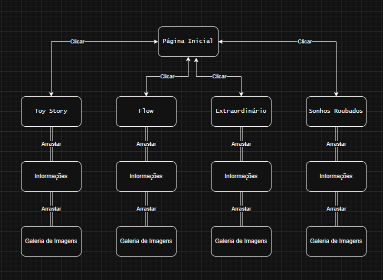

# ToyGame
* **Integrantes:**
  
  - Igor Cafazzi
  - Igor Michelini

* **Descrição do Projeto:**
  
  Protótipo do site mobile da mostra cultural. Apresenta os filmes Toy Story, Flow, Extraordinário e Sonhos Roubados, cada um com suas informações (sinopse, direção, produção, empresa, studio, gênero, dados de lançamento, elenco e links) e galeria de imagens para dar uma noção visual de cada filme.

* **Mapa de Navegação**
  
  
  
  Ao clicar nas imagens do menu principal, o usuário será redirecionado à pagina específica do filme. Nela, ele pode arrastar o dedo e mudar as telas entre a entrada, informações e galeria de imagens.  
  Todas as telas contém um botão para voltar ao menu inicial.
  
* **Links da Wiki:**
  [Home](https://github.com/IgorCafazzi/MobileFilmes/wiki)
  
  [Protótipo do Site Mobile](https://github.com/IgorCafazzi/MobileFilmes/wiki/Prot%C3%B3tipo-do-Site-Mobile)

  [Mapa de Navegação](https://github.com/IgorCafazzi/MobileFilmes/wiki/Mapa-de-Navega%C3%A7%C3%A3o)

  [Descrição da Aplicação](https://github.com/IgorCafazzi/MobileFilmes/wiki/Descri%C3%A7%C3%A3o-da-Aplica%C3%A7%C3%A3o)
